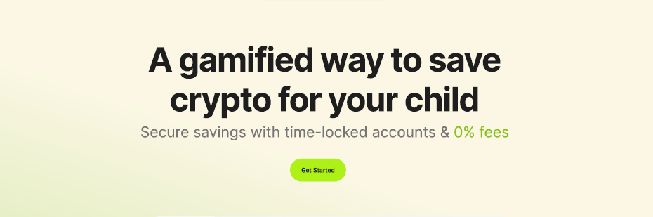

# SafeNest - Web3 Smart Savings Platform for Children

 // change banner

<h4 align="center">
<a href="">Documentation</a>
  <a href="https://www.youtube.com/watch?v=dkONR9dJD2g">Video Walkthrough</a>
</h4>

## Overview

Netsafe is a Web3-based savings platform designed to help parents in high-inflation economies secure their children's financial future. By using blockchain technology and stablecoins, Netsafe ensures that savings are protected from inflation and can only be accessed by the child when they turn 18. Our platform is easy to use, combining advanced technology with a user-friendly interface to make saving both simple and secure.

## Features

-   **Seamless Onboarding**: Quick account creation for children using email or social logins.
-   **Time-Locked Savings**: Funds are securely locked until the child turns 18, ensuring long-term savings.
-   **Savings Goals**: Set and track progress toward specific financial objectives like "New Bike" or "College Fund".
-   **Emergency Withdrawals**: Allows access to funds in urgent situations with proper authorization.
-   **User-Friendly Interface**: Intuitive design for easy navigation and management of savings.
-   **Stablecoin Integration**: Utilizes stablecoins to protect savings against inflation.

## Technologies Used

### Frontend

-   **React** and **Next.js**: For building a responsive and dynamic user interface.
-   **Tailwind CSS**: For efficient and customizable styling.

### Smart Contracts

-   **Solidity**: Smart contract development language.
-   **Foundry**: Development framework for testing and deployment.

### Blockchain Integration

-   **The Graph**: For efficient blockchain data indexing and querying.
-   **Optimism**: Deployed on the OP Sepolia testnet.
-   **Lisk**: Deployed on the Lisk Sepolia testnet.
-   **Dynamic**: Implementing social login functionality.

## How It Works

Netsafe leverages blockchain technology to create a secure and transparent savings platform:

1. **Account Creation**: Parents can easily create accounts for their children using email or social logins, powered by Dynamic for a seamless onboarding experience.

2. **Time-Locked Savings**: Our smart contracts implement a timelock mechanism that restricts access to funds until the child turns 18. This is achieved through:

    - Storing the child's birth date securely on-chain.
    - Implementing time-based conditions in the withdrawal functions.

3. **Savings Goals**: Parents can set specific savings goals within the platform. The smart contract tracks contributions and calculates progress toward each goal.

4. **Stablecoin Integration**: To combat inflation, all savings are stored in stablecoins. This provides a stable value over time, protecting the savings from currency fluctuations.

5. **Emergency Withdrawals**: A carefully designed authorization system allows for emergency withdrawals. This involves:
    - Multi-signature approval process.
    - Timelocks to prevent immediate withdrawals.
    - Logging of withdrawal reasons for transparency.

## Smart Contract Implementation

Our smart contracts form the backbone of Netsafe's functionality:

| Contract     | Description                                            | Optimism Sepolia (CA)                      | Lisk Sepolia (CA)                          |
| ------------ | ------------------------------------------------------ | ------------------------------------------ | ------------------------------------------ |
| SafeNest.sol | Main contract handling savings, goals, and withdrawals | 0x939Dc4B20BAB0F0786F88273c08F620E085285eC | 0x939Dc4B20BAB0F0786F88273c08F620E085285eC |

The `SafeNest.sol` contract includes:

-   Functions for depositing and withdrawing funds.
-   Logic for setting and tracking savings goals.
-   Time-lock mechanisms for fund protection.
-   Emergency withdrawal protocols with proper authorization checks.

## Requirements

Before you begin, you need to install the following tools:

-   [Node (>= v18.17)](https://nodejs.org/en/download/)
-   Yarn ([v1](https://classic.yarnpkg.com/en/docs/install/) or [v2+](https://yarnpkg.com/getting-started/install))
-   [Git](https://git-scm.com/downloads)

## Quickstart

To get started with Scaffold-ETH 2, follow the steps below:

1. Clone this repo & install dependencies

```
git clone https://github.com/scaffold-eth/scaffold-eth-2.git
cd scaffold-eth-2
yarn install
```

2. Run a local network in the first terminal:

```
yarn chain
```

This command starts a local Ethereum network using Hardhat. The network runs on your local machine and can be used for testing and development. You can customize the network configuration in `hardhat.config.ts`.

3. On a second terminal, deploy the test contract:

```
yarn deploy
```

This command deploys a test smart contract to the local network. The contract is located in `packages/hardhat/contracts` and can be modified to suit your needs. The `yarn deploy` command uses the deploy script located in `packages/hardhat/deploy` to deploy the contract to the network. You can also customize the deploy script.

4. On a third terminal, start your NextJS app:

```
yarn start
```

Visit your app on: `http://localhost:3000`. You can interact with your smart contract using the `Debug Contracts` page. You can tweak the app config in `packages/nextjs/scaffold.config.ts`.

**What's next**:

-   Edit your smart contract `YourContract.sol` in `packages/hardhat/contracts`
-   Edit your frontend homepage at `packages/nextjs/app/page.tsx`. For guidance on [routing](https://nextjs.org/docs/app/building-your-application/routing/defining-routes) and configuring [pages/layouts](https://nextjs.org/docs/app/building-your-application/routing/pages-and-layouts) checkout the Next.js documentation.
-   Edit your deployment scripts in `packages/hardhat/deploy`
-   Edit your smart contract test in: `packages/hardhat/test`. To run test use `yarn hardhat:test`

## Documentation

Visit our [docs](https://docs.scaffoldeth.io) to learn how to start building with Scaffold-ETH 2.

To know more about its features, check out our [website](https://scaffoldeth.io).

## Contributing to Scaffold-ETH 2

We welcome contributions to Scaffold-ETH 2!

Please see [CONTRIBUTING.MD](https://github.com/scaffold-eth/scaffold-eth-2/blob/main/CONTRIBUTING.md) for more information and guidelines for contributing to Scaffold-ETH 2.
